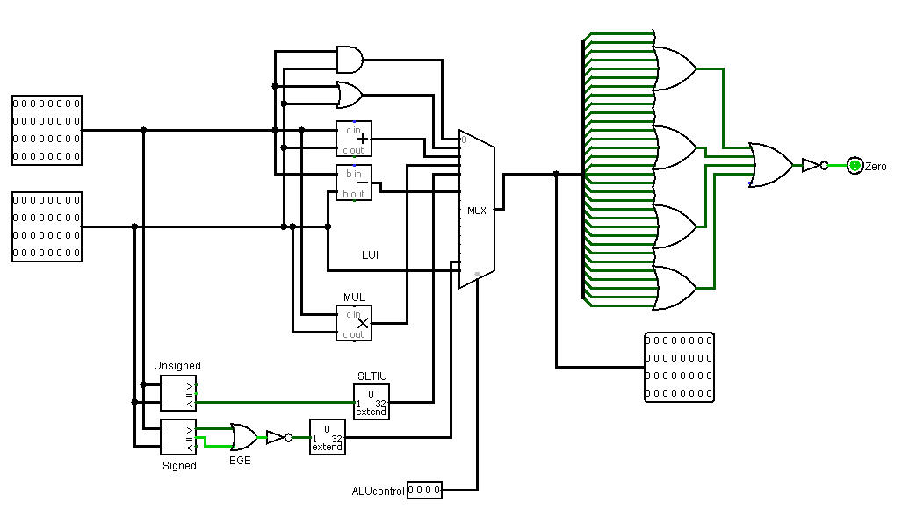
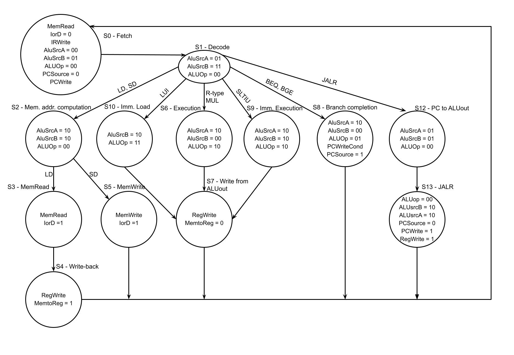
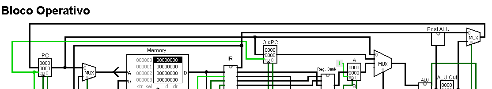
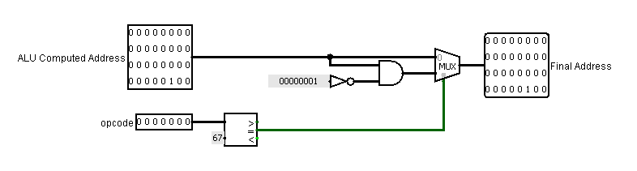
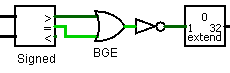
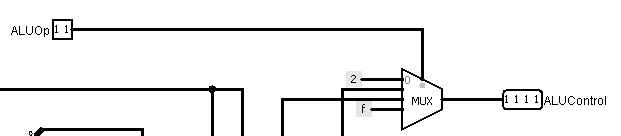
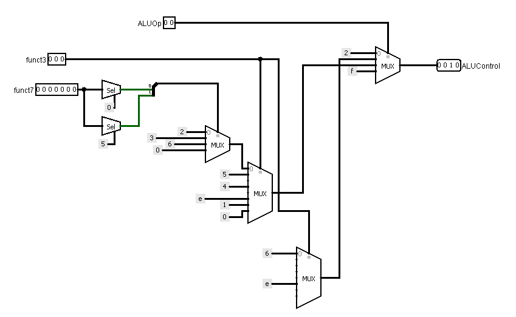
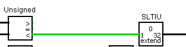

## Multiciclo

### ImmGen

Igual ao monociclo

### ALU

O mapa de códigos é o mesmo do monociclo, porém a implementação é levemente diferente: Não há sinal de **Less** e a saída do comparador do BGE é negada para que o zero signifique verdadeiro.

### Mapa de Estados

---

#### 1. JALR - jalr rd, imm(rs1)

- **Opcode**: 0x67, formato I.
- **Fluxo de Estados**: S0 (Fetch) → S1 (Decode) → S12 (PC to ALU Out) → S13 (Jump & Link) → S0.

O JALR precisa realizar duas ações: desviar para rs1 + imm e salvar PC + 4 em rd. Para evitar modificações maiores no já complexo datapath, foram utilizados dois estados extras para essa operação:

- **S12 - 0x0500**: A ALU soma OldPC com 4 e armazena o resultado em ALU Out, já que, durante a execução de uma instrução, PC é o endereço da próxima instrução.
- **S13 - 0x0A82**: A ALU calcula o endereço de destino rs1 + imm (ALUSrcA=10, ALUSrcB=10, ALUop=00). A saída direta da ALU tem seu bit menos significativo zerado e é gravada no PC (PCSource=0, PCWrite=1). Simultaneamente, a escrita no banco de registradores é habilitada (RegWrite=1, MemtoReg=0), gravando em rd o valor contido em ALU Out, que é o endereço da próxima instrução.

O sinal de enable do PC foi conectado ao sinal de enable do OldPC, para que ele atualize seu valor apenas quando o PC atualizar.

Para zerar o bit menos significativo foi criado um pequeno circuito (postALU) para evitar poluir o datapath principal.

---

#### 2. BGE - bge rs1, rs2, imm

- **Opcode**: 0x63, funct3=101, formato B.
- **Fluxo de Estados**: S0 (Fetch) → S1 (Decode) → S8 (Branch Completion) → S0.

Reaproveita o caminho da instrução BEQ. No caminho de dados, apenas a ALU foi modificada com a adição de uma operação de comparação "maior ou igual" que tem o resultado invertido para que zero indique verdadeiro.

A escolha do uso desta operação ocorre através dos bits de funct3 e ALUOp.

O cálculo do endereço do desvio (OldPC + (imm << 1)) já é calculado no estado **S1** e encontra-se armazenado em ALU Out para a escrita em PC.

---

#### 3. LUI - lui rd, imm20

- **Opcode**: 0x37, formato U.
- **Fluxo de Estados**: S0 (Fetch) → S1 (Decode) → S10 (Imm. Load) → S7 (Writeback ALU) → S0.

Carrega o imediato de 20 bits deslocado 12 posições à esquerda no registrador rd.

- **S10 - 0x3800**: O imediato do tipo U é selecionado na entrada B da ALU (ALUSrcB=10). Com ALUop=11, a ALU_Control seleciona a operação "passa B" (15) da ALU. O valor é armazenado em ALU Out.

Por fim, é reaproveitado o write-back padrão da ALU, gravando ALU Out em rd.

O alinhamento dos 12 bits inferiores com zeros é realizado estaticamente no módulo ImmGen (formato U).

---

#### 4. MUL - mul rd, rs1, rs2

- **Opcode**: 0x33, funct3=000, funct7=0000001, formato R.
- **Fluxo de Estados**: S0 (Fetch) → S1 (Decode) → S6 (R-Type Execution) → S7 (Writeback ALU) → S0.

Por ser uma instrução simples de tipo R, compartilha exatamente o fluxo de estados padrão para essas instruções: execução no estado **S6** (0x2200) e escrita no estado **S7** (0x0080). Para diferenciar as instruções R implementadas bastam os bits 0 e 5 de funct7, que no caso do MUL deve ser 1.

Foi utilizado um multiplicador comum do logisim, escolhido com o código 3, para realizar a operação na ALU. Os bits de carry são ignorados.

---

#### 5. SLTIU - sltiu rd, rs1, imm12

- **Opcode**: 0x13, funct3=011, formato I.
- **Fluxo de Estados**: S0 (Fetch) → S1 (Decode) → S9 (Imm. Execution) → S7 (Writeback ALU) → S0.

Realiza a comparação sem sinal entre rs1 e o imediato estendido com sinal: se rs1 é menor que o imediato, grava 1 em rd; caso contrário, 0.

- **S9 - 0x2A00**: O operando A recebe rs1 (ALUSrcA=10) e o operando B recebe o imediato estendido via ImmGen (ALUSrcB=10), com ALUop=10. A ALU_Control decodifica funct3=011 e seleciona o código 4 na ALU.

Na ALU é utilizado um comparador unsigned para decidir o valor de saída (0 ou 1).

Também reaproveita o write-back do tipo R, gravando o resultado de ALU Out em rd.
